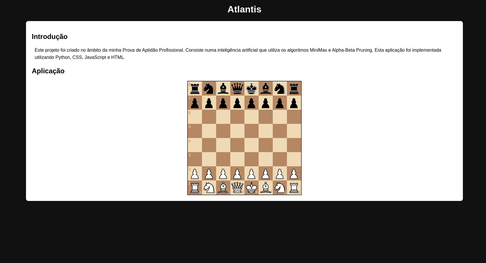

# Atlantis

  O projeto Atlantis é um projeto que será criado no âmbito da realização da minha PAP (Prova de Aptidão Profissional). Consiste num *engine* de xadrez que joga utilizando o módulo *chess* da biblioteca Python e os algoritmos *Alphabeta* e *Pruning*.

  O engine é implementado numa aplicação web em **Flask** na qual o utilizador pode jogar contra o mesmo de *brancas*

# Ilustração

  

